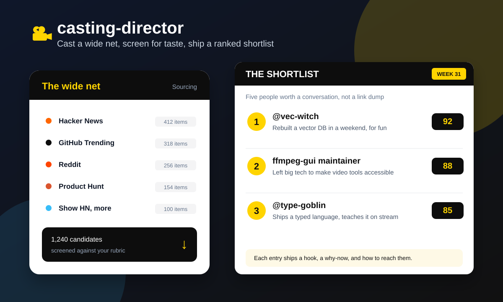

<p align="center">
  <picture>
    <source media="(prefers-color-scheme: dark)" srcset="web/assets/logo-dark.svg">
    
  </picture>
</p>

<p align="center">
  <a href="https://github.com/evillollive/casting-director/actions/workflows/tests.yml"></a>
  <a href="https://github.com/evillollive/casting-director/actions/workflows/deploy.yml"></a>
  <a href="LICENSE"></a>
  <a href="#use-it-in-your-browser"></a>
</p>

# casting-director

**Cast stories, not link slop.** An agentic AI skill that hands you a short ranked list of **people worth a conversation**: the hook for each, why they'd be good on camera, and how to reach them. It doesn't hand you "40 trending repos."

<p align="center">
  
</p>

Think of it as a casting director's workflow, run as a pipeline.

## The four stages

1. **Sourcing**: cast a wide net across many feeds. Not just the obvious three (Hacker News, GitHub, Reddit) but the places that surface people the aggregators structurally miss: makers and hardware, game jams, video and streams, the fediverse, non-English communities, and science, civic, and accessibility work. See [`sources.md`](sources.md).
2. **Screening**: score each candidate against a casting rubric you author, then cut hard. This is the product.
3. **The shortlist**: a ranked report where every entry is a short casting brief, not a link dump.
4. **The rolodex**: persistent memory, so nobody gets re-surfaced and "great but not now" people get parked for later.

The wide net is the easy part. What this skill is really for is **taste and judgment**: turning a feed of launches into a handful of castable human stories. Cast wide, then cut: a wider net only helps if the screen gets stricter at the same time.

Because these are real people and not repos, the rubric carries a **consent and care** section: what counts as public information, when to hold a name back, and the [`Sensitivity`](rubric.md) line a brief should carry when a story involves a minor, a person at risk, or anything a subject would be alarmed to see written down.

## What's in here

The prompt remains the canonical editorial runtime artifact. The supporting
implementations automate that contract without replacing it.

| Path | What it is |
|------|------------|
| [`prompts/tier0-weekly-scan.md`](prompts/tier0-weekly-scan.md) | **The runtime artifact.** Self-contained and canonical for a run: sources, the compact rubric, the gates, verification rules, exclusions, and the exact output format. Paste it in and run it weekly. |
| [`rubric.md`](rubric.md) | The expanded rubric: scoring guide, gate logic, false-positive patterns, list-level diversity, and a worked example. The deeper companion to the compact rubric in the prompt. |
| [`SKILL.md`](SKILL.md) | A thin agent-skill wrapper (frontmatter + when-to-use + non-negotiables) that points at the prompt and rubric rather than duplicating them. |
| [`sources.md`](sources.md) | The source list with its 2026 access realities (what's free, what's blocked, what costs money). |
| [`rolodex/`](rolodex/) | Persistent memory: the do-not-resurface list and the taste log that teach the tool your eye over time. |
| [`roadmap.md`](roadmap.md) | The three-tier build path, including the complete Tier 2 app contract. |
| [`tools/casting_eval.py`](tools/casting_eval.py) | A linter for an actual run's output: catches hallucinated candidates, missing sources, undated or stale "why now", gate violations, duplicates, a shortlist clustered on one feed, resurfaced names (including in the parking lot), and briefs that touch a minor or paste private contact details. |
| [`tools/weekly_scan.py`](tools/weekly_scan.py) | The Tier 1 pipeline: pulls public feeds, dedupes, screens, renders the canonical report, and refuses to complete if the evaluator finds an error. |
| [`tools/prompt_builder.py`](tools/prompt_builder.py) | Builds the screening prompt from the canonical Tier 0 markdown, current rolodex, TUNING, and recent taste-log lines. |
| [`tools/sources/`](tools/sources/) | Public HTTP connectors for Hacker News, GitHub, Reddit, Hackaday, and itch.io, all returning one shared candidate shape. |
| [`web/`](web/) | A static browser app: prep this week's prompt with your rolodex baked in, then lint a run's shortlist with an in-browser port of the evaluator. No account, no API key, nothing uploaded. Deployed to GitHub Pages. |
| [`src/app/`](src/app/) | The authenticated Tier 2 Next.js product: shortlist, live scans, rolodex, tuning, taste history, and immutable scan history. It remains separate from the static Pages app. |
| [`prisma/`](prisma/) | The Tier 2 Postgres schema and migration, including relational rolodex history, scan audit data, immutable tuning and taste revisions, and database quality gates. |
| [`src/domain/`](src/domain/) | Provider-neutral typed API and lifecycle contracts. The canonical rubric and evaluator are not duplicated here. |
| [`tests/`](tests/) | The test suite: spec-conformance checks plus adversarial output fixtures. See [`tests/README.md`](tests/README.md). |

## How to use it this week

**Tier 0** remains the zero-infrastructure path:

1. Paste the current contents of [`rolodex/do-not-resurface.md`](rolodex/do-not-resurface.md) into the prompt's DO-NOT-RESURFACE block, and update its TUNING block.
2. Paste [`prompts/tier0-weekly-scan.md`](prompts/tier0-weekly-scan.md) into an AI assistant with live web search on, or a browsing agent that can reach the sources.
3. Read the shortlist. After each run, append a line to the prompt's TASTE LOG based on what it nailed and what it missed.

Want to see what a finished shortlist looks like first? [`tests/fixtures/run_good.md`](tests/fixtures/run_good.md) is a clean sample run that passes every check.

Those edits are the real work. They calibrate the tool's taste. **Don't write a line of pipeline code until the rubric is stable** (see [`roadmap.md`](roadmap.md)). The single source of truth for a run is the prompt; `rubric.md` is where stable lessons graduate, and the two stay in sync with a one-line update when something changes.

## Run the Tier 1 pipeline

Tier 1 automates the same loop without replacing its canonical prompt or its taste layer. It reads public feeds, tolerates and reports individual source failures, removes do-not-resurface and previously seen candidates, asks a configurable model endpoint for structured briefs, applies the two real shortlist gates, renders the exact Tier 0 report format, and runs `casting_eval.py` before recording the run as seen.

Set the provider-neutral endpoint configuration:

```bash
export CASTING_LLM_API_KEY="..."
export CASTING_LLM_API_URL="https://your-model-endpoint.example/v1/chat/completions"
export CASTING_LLM_MODEL="your-model"
```

Optional TUNING values use `CASTING_TUNING_BEAT`, `CASTING_TUNING_HARD_NOS`, and `CASTING_TUNING_MORE_OF`. Then run:

```bash
python tools/weekly_scan.py \
  --output weekly-report.md \
  --run-date "$(date -u +%Y-%m-%d)"
```

Reddit uses the official public per-subreddit Atom feeds and adapts to their strict reset headers. If hosted runners consistently block those feeds with HTTP 401/403, wrap `RedditSource` in the existing `ExpectedFailure` registration in [`tools/sources/__init__.py`](tools/sources/__init__.py) so known IP blocking stays distinct from connector errors. A future OAuth throughput upgrade should read `REDDIT_CLIENT_ID` and `REDDIT_CLIENT_SECRET` from secrets plus a descriptive `REDDIT_USER_AGENT` setting.

The durable seen list lives at [`rolodex/seen.json`](rolodex/seen.json) and is committed after each successful scheduled run, so resets are visible in git history. Shortlisted and hard-excluded candidates stay there permanently. Parking-lot candidates receive an eight-week cooldown and can return when their timing changes. The rollout imports the old Actions-cached `.casting/seen.json` once when available. If a non-empty run starts from an empty seen store, the report carries a loud warning for human review.

[`.github/workflows/weekly-scan.yml`](.github/workflows/weekly-scan.yml) can be dispatched by hand and includes a disabled Monday schedule. Configure `CASTING_LLM_API_KEY` as an Actions secret, plus `CASTING_LLM_API_URL` and `CASTING_LLM_MODEL` as repository variables. A publishing run opens a GitHub Issue only after a second, explicit evaluator pass succeeds, then commits the updated seen state to `main`. If delivery fails, memory is not advanced, so a transient Issue failure cannot silently discard the shortlist.

The pipeline is complete and tested, but its cron is intentionally disabled until live screening is proven. Manual dispatch defaults to `dry_run: true`: it runs sourcing, screening, rendering, and `casting_eval.py`, then uploads the report as an artifact without opening an Issue or advancing seen memory. Re-enable the commented schedule only after one reviewed dry run passes the evaluator and reads like casting briefs rather than link slop.

## Use it in your browser

There's a static browser front end for the Tier 0 loop in [`web/`](web/). It doesn't run the scan (that's still an AI job that needs live web search and judgment); it removes the copy-paste bookkeeping around it and runs entirely on your device, with no account and no API key:

- **Prep a run** builds this week's prompt with three things injected: your do-not-resurface list, this week's TUNING, and your recent taste-log lines. All three are remembered between weeks, so a fresh chat starts with the eye your previous runs taught it.
- **Evaluate a run** lints the shortlist that assistant returns. It's a faithful in-browser port of `tools/casting_eval.py` (a test asserts the two agree violation-for-violation on every fixture), so gates, required fields, dated and recent "why now", duplicates, feed clustering, resurfaced names, and the sensitivity checks all run offline. Today's date is passed in, so staleness is judged against the week you're actually in.
- **Close the loop** with one click after an evaluation: add the shortlisted names to the rolodex as `surfaced` and the parking-lot names as `parked`, so next week's prompt excludes them automatically.
- **Rolodex** manages your do-not-resurface list in the browser's local storage and exports markdown that's drop-in compatible with [`rolodex/do-not-resurface.md`](rolodex/do-not-resurface.md).
- **Taste log** keeps one line per run about what you loved and what you cut, exports markdown for [`rolodex/taste-log.md`](rolodex/taste-log.md), and feeds those lines back into every prompt you prep.

Open the hosted app:

```text
https://evillollive.github.io/casting-director/
```

Or run it locally:

```bash
cd web
python3 -m http.server 8000
# open http://localhost:8000
```

The app fetches the real prompt, rubric, and sources from `web/content/`, which is a byte-for-byte mirror of the canonical files. Regenerate it with `python tools/sync_web_content.py` after editing any of them; a test fails if the copies drift.

## Run Tier 2

Tier 2 layers 1 through 3 add a server-rendered Next.js application,
authenticated product APIs, Postgres persistence, and a separately run durable
worker while keeping `web/` and the Python engine authoritative. The worker and
tuning preview call the canonical Python sourcing, prompt, screening,
rendering, and evaluator modules; they do not duplicate the rubric in
TypeScript.

Requirements are Node.js 20.9 or newer and PostgreSQL. Configure the variables
in [`.env.example`](.env.example), then run:

```bash
npm ci
npm run db:migrate
npm run auth:bootstrap -- --email you@example.com --name "Your name"
npm run dev
# in a second process
npm run worker
```

The bootstrap command explicitly creates the first workspace membership and a
random, expiring session token. Enter that token at `/sign-in`; the browser
stores it only in an HTTP-only, same-site cookie. Production never assumes a
development identity or permits unauthenticated product writes. Add later team
members by rerunning the command with their email and name. The first member is
an administrator and subsequent members are regular members.

The health endpoint at `/api/health` reports database readiness, fresh workers,
queued jobs, and expired leases without returning secret values. Run
`npm run worker -- --healthcheck` for worker readiness or
`npm run worker -- --once` to process at most one job. The application is
deployment provider neutral: use any Node.js runtime and PostgreSQL service
that preserve durable jobs and backups. See
[`docs/tier2-scan-engine.md`](docs/tier2-scan-engine.md).

Authenticated pages are available at `/` (Shortlist), `/scans/live`,
`/scans`, `/rolodex`, `/tuning`, and `/taste-log`. The product APIs cover
candidate filters and cursor pagination, optimistic candidate edits and bulk
actions, immutable tuning revisions, revisioned taste observations, and durable
scan polling/history. Failed scan output is exposed only as diagnostic output,
never as a shippable shortlist.

Prisma models durable users and workspace membership, authentication identities
and sessions, candidate identity and merge provenance, normalized tags,
append-only notes, candidate status history, scans and per-source progress,
historical screening snapshots, evaluator violations, tuning revisions, taste
log revisions, and markdown sync state. The migration enforces one active scan
per workspace and rejects a completed scan unless evaluation passed with no
ERROR violations.

Preview the existing markdown memory without a database write:

```bash
npm run db:import-memory
```

After migrations and initial team-user provisioning, import it with:

```bash
npm run db:import-memory -- --write --actor editor@example.com
```

The actor is required when taste-log rows exist so authorship is preserved.
This command is the bootstrap path only. Conflict-aware two-way repository sync
belongs to layer 4, together with backups and deployment topology. Interface
adaptation provenance is recorded in
[`docs/tier2-provenance.md`](docs/tier2-provenance.md).

## The build path, in one breath

- **Tier 0**: one rich prompt, run manually each week, to calibrate taste. It stays available as the no-infrastructure path.
- **Tier 1**: the implemented sweet spot. Public feed connectors, canonical prompt assembly, persisted dedupe, structured screening, exact report rendering, evaluator enforcement, and scheduled GitHub Issues.
- **Tier 2**: a hosted app with Postgres, a durable rolodex, scan operations, tuning, taste history, and two-way markdown sync. Build it only after Tier 1 reports are trusted.

Do them in order. The rolodex is the part that compounds.

## Testing

Run the canonical Python suite with `pip install -r requirements-dev.txt` then
`pytest tests/ -q`. It covers spec conformance, the output evaluator, source
connectors, the Tier 1 pipeline, and parity with the static browser evaluator.

For Tier 2, run `npm ci`, `npm test`, `npm run lint`, and `npm run build`. The
TypeScript suite covers configuration errors, API optimistic concurrency,
markdown parsing, shortlist gate semantics, scan completion rules, and database
invariants. You can still run the evaluator directly with
`python tools/casting_eval.py run.md --dnr rolodex/do-not-resurface.md`.

## Deploy

The browser app deploys to GitHub Pages from `main` via [`.github/workflows/deploy.yml`](.github/workflows/deploy.yml). On each push it computes a semantic version from Conventional Commits, tags a GitHub Release, re-syncs `web/content/`, stamps `web/version.js`, and publishes `web/`. The first successful run enables Pages automatically.

## Contributing and license

Most contributing here is teaching the tool your taste, not writing code. See [`CONTRIBUTING.md`](CONTRIBUTING.md) for the weekly loop and the one rule that matters (graduating TASTE LOG patterns into the rubric and prompt together). Licensed under AGPL-3.0; see [`LICENSE`](LICENSE).
